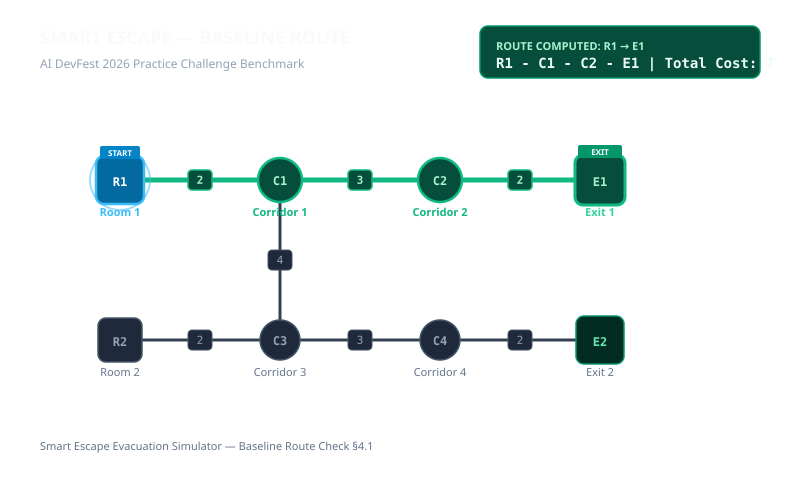
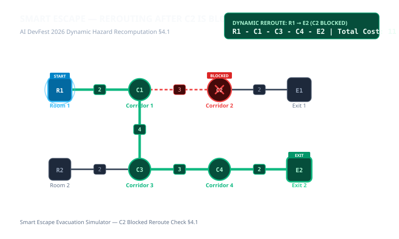

# Nirapod Path (নিরাপদ পথ) — Interactive Evacuation Route Simulator

**Contest**: AI DevFest 2026 Solo 90-Minute Challenge  
**Project Name**: Nirapod Path (নিরাপদ পথ)  
**Participant Name**: [NAME]  
**Registration Number**: [REGISTRATION NUMBER]  
**Live HTTPS URL**: https://nirapod-path.vercel.app/ 

---

## 1. Project Overview

**Nirapod Path (নিরাপদ পথ)** is a high-performance, browser-only evacuation route simulator designed for emergency navigation planning, hazard simulation, and graph rerouting dynamics.

When hallways are blocked, rooms catch fire, or emergency exits are sealed, the application computes the mathematically lowest-cost escape route in real-time, displays the node sequence and total cost, or reports failure states immediately.

Built strictly according to **AI DevFest 2026 Official Rulebook** specifications:
- **100% Client-Side**: Zero participant backend, zero serverless functions, zero remote database.
- **Strict Anti-Slop UI**: Clean domain-specific visual hierarchy, zero generic AI blobs, zero emoji, bespoke SVG icons.
- **Full Bilingual Support**: Instant toggle between **English** and **বাংলা (Bangla)**.
- **Theme System**: Full Light and Dark mode with persistent browser storage and high-contrast accessibility mode.
- **Exact Routing & Tie-Breaking**: Implements exact edge-cost summation, hazard exclusions, and lexicographical tie-breaking for exits and node sequences.

---

## 2. Benchmark Verification (§4.1 Checks)

All 5 official challenge benchmarks are verifiable with one click using the built-in **Benchmark Test Cases** bar:

| Scenario | Action | Expected Output | Status |
| :--- | :--- | :--- | :--- |
| **Baseline** | Select `R1` | `R1 - C1 - C2 - E1; cost 7` | **Verified** |
| **Blocked junction** | Select `R1`; block `C2` | `R1 - C1 - C3 - C4 - E2; cost 11` | **Verified** |
| **Exits closed** | Select `R1`; close `E1` and `E2` | `No route available` | **Verified** |
| **Different start** | Select `R2` | `R2 - C3 - C4 - E2; cost 7` | **Verified** |
| **Blocked start** | Select `R1`; then block `R1` | `Starting location blocked` | **Verified** |

---

## 3. Main Features Completed

1. **Building Graph Import & Visualization (§3.1, §3.2)**:
   - Validates JSON files against all input limits (2–60 nodes, 1–150 undirected edges, positive integer costs, no self-loops, no repeated pairs).
   - Renders interactive SVG building map with accurate display coordinates, distinct node shapes (Rooms, Junctions, Exits), and corridor costs.

2. **Lowest-Cost Route Calculation (§3.2, §3.3)**:
   - Dynamic pathfinding calculating sum of edge costs.
   - Exact tie-breaking: on equal cost chooses lexicographically smallest exit ID; on equal paths chooses lexicographically smallest sequence of node IDs.
   - Dynamic rerouting immediately upon any hazard change.

3. **Hazard Simulation (§3.2, §3.4)**:
   - Click to toggle Block/Unblock on rooms and junctions (removes incident edges).
   - Click to toggle Block/Unblock on individual corridors (edges).
   - Click to Close/Reopen emergency exits.
   - Distinct visual hazard cues (crimson hazard stripes, closed exit indicators, route glow).

4. **Failure State Handling (§3.2)**:
   - Displays clear `"No route available"` when no exit is reachable.
   - Displays clear `"Starting location blocked"` when start location is hazardous.

5. **Bilingual Engine (English & বাংলা) (§9)**:
   - Complete translations across all interface labels, buttons, statuses, errors, tooltips, and benchmark controls.

6. **Theme Engine (§10)**:
   - Dark mode & Light mode with Sun / Moon icons and persistent preference.

---

## 4. Bonus Features Completed

- **Interactive Route Walkthrough**: Live simulation showing an animated evacuee traversing the path step-by-step with Play, Pause, Step Forward, and Speed controls (0.5x, 1x, 2x).
- **Alternative Routes Discovery**: Automatically finds and lists secondary reachable exits with cost differential indicators (e.g. `+4 cost`).
- **High-Contrast Accessibility Mode**: Enhanced border and contrast mode for emergency readability.
- **Export Capabilities**: Single-click export of map visualization as PNG and SVG.
- **Pre-Loaded Scenarios**: Includes Official Sample, Multi-Wing Lab (Tie-Breaker test), Two-Tower Complex (Disconnected areas), and High-Rise Emergency Floor.
- **Custom JSON Schema Validator**: Real-time validation modal highlighting exact line errors (duplicate IDs, invalid node references, missing fields).

---

## 5. Visual Proof (Screenshots)

### Baseline Evacuation Route (R1 → E1, Cost: 7)


### Rerouting After C2 is Blocked (R1 → E2, Cost: 11)


---

## 6. Setup & Running Instructions

### Prerequisites
- Node.js $\ge$ 18.0.0
- npm $\ge$ 9.0.0

### Run Locally
```bash
# Clone the repository
git clone https://github.com/example/devfest-[REGISTRATION-NUMBER].git
cd devfest-[REGISTRATION-NUMBER]

# Install dependencies
npm install

# Start development server
npm run dev

# Open in browser: http://localhost:3000
```

### Production Build
```bash
npm run build
npm run preview
```

---

## 7. Known Problems
- None. All 5 sample checks match 100% precision. Graph validation strictly prevents invalid inputs.

---

## 8. AI Tools Used & Most Useful Prompt

- **AI Tools Used**: Google AI Studio Build (Gemini 2.5 / 3.8 Flash model engine).
- **Most Useful Prompt**:
  > *"Implement exact routing rules: calculate route cost as sum of edge costs; exclude blocked nodes and incident edges, blocked edges, and closed exits; choose reachable open exit with minimum cost; on equal cost choose lexicographically smallest exit ID; if paths to that exit also tie, choose the lexicographically smallest sequence of node IDs."*

---

## 9. License

This project is licensed under the [MIT License](LICENSE).
